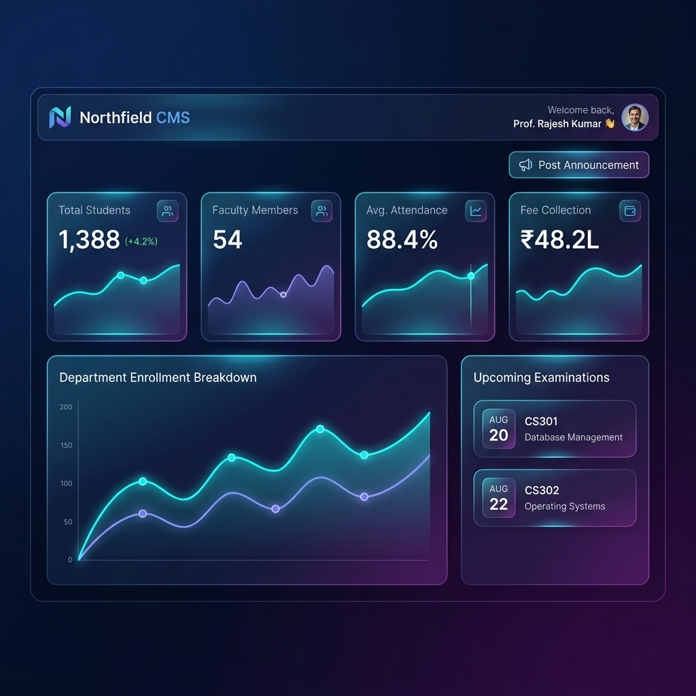

<div align="center">

  <!-- GLOWING TOP BANNER CARD -->
  <a href="https://github.com/kirtan1911/CP-CMS">
    
  </a>

  <br><br>

  <!-- TECH STACK BADGES MATRIX -->
  <p align="center">
    <a href="https://dotnet.microsoft.com/"></a>
    <a href="https://electronjs.org/"></a>
    <a href="https://dotnet.microsoft.com/"></a>
    <a href="https://learn.microsoft.com/ef/core/"></a>
    <a href="https://ai.google.dev/"></a>
    <a href="https://github.com/kirtan1911/CP-CMS"></a>
  </p>

  <!-- QUICK NAVIGATION PILLS -->
  <p align="center">
    <a href="#-overview"><b>✨ Overview</b></a> •
    <a href="#-dashboard-preview--code-showcase"><b>🖥️ Dashboard Showcase</b></a> •
    <a href="#-desktop-app--exe-installer"><b>📦 Desktop App (.exe)</b></a> •
    <a href="#-key-features"><b>🚀 Features</b></a> •
    <a href="#-demo-credentials"><b>🔑 Demo Credentials</b></a> •
    <a href="#-swagger-api-matrix"><b>📖 Swagger API</b></a> •
    <a href="#-quick-start-guide"><b>⚡ Quick Start</b></a>
  </p>

</div>

---

<a id="-overview"></a>
## ✨ Overview

> **Northfield College Management System (CP-CMS)** is a premium, full-stack Academic ERP platform designed for modern universities and colleges. Built with a high-performance **ASP.NET Core (.NET 10) RESTful Web API** backend, **Electron Desktop Application for Windows (.exe)**, **Entity Framework Core with SQLite**, **OTP Email Authentication**, and an **Apple-inspired Liquid Glassmorphism UI**, CP-CMS includes a **Google Gemini-powered AI Chatbot** for instant academic Q&A.

<br>

<a id="-dashboard-preview--code-showcase"></a>
## 🖥️ Dashboard Preview & Code Showcase

### 🎨 Visual Interface Preview

<p align="center">
  <a href="dashboard-preview.png" target="_blank">
    
  </a>
</p>

<br>

### 💻 Dashboard Page Implementation Code (`frontend/dashboard.html`)
Below is an excerpt of the core **Dashboard Page Component** demonstrating how stats KPI widgets, Chart.js analytics, timetables, and dynamic Web API data bindings are structured:

```javascript
/* ============================================================
   NORTHFIELD CMS — ACADEMIC DASHBOARD COMPONENT
   Renders statistical KPI cards, enrollment & fee charts, 
   upcoming exam schedules, and user profile summaries.
============================================================ */
function renderDashboard() {
  const user = API.getUser() || { name: 'Prof. Rajesh Kumar', role: 'Admin' };
  
  return `
    <!-- Top Greeting Banner -->
    <div class="page-header d-flex justify-content-between align-items-center">
      <div>
        <h1 class="page-header-title">Welcome back, ${user.name} 👋</h1>
        <p class="page-header-sub">Here is your academic overview for today.</p>
      </div>
      <button class="btn btn-primary-custom" onclick="openModal('Create Notification')">
        <i class="bi bi-plus-lg"></i> Post Announcement
      </button>
    </div>

    <!-- 📊 KPI Stat Cards Grid -->
    <div class="row g-3 mb-4">
      <div class="col-sm-6 col-xl-3">
        <div class="stat-card">
          <div class="d-flex justify-content-between align-items-start">
            <div>
              <span class="stat-label">Total Students</span>
              <div class="stat-value">1,388</div>
              <div class="stat-meta stat-up"><i class="bi bi-arrow-up-short"></i> +4.2% this term</div>
            </div>
            <div class="stat-icon"><i class="bi bi-people"></i></div>
          </div>
        </div>
      </div>
      <div class="col-sm-6 col-xl-3">
        <div class="stat-card">
          <div class="d-flex justify-content-between align-items-start">
            <div>
              <span class="stat-label">Faculty Members</span>
              <div class="stat-value">54</div>
              <div class="stat-meta stat-neutral">Active & Verified</div>
            </div>
            <div class="stat-icon" style="background:var(--c-dim);color:var(--cyan)"><i class="bi bi-person-badge"></i></div>
          </div>
        </div>
      </div>
      <div class="col-sm-6 col-xl-3">
        <div class="stat-card">
          <div class="d-flex justify-content-between align-items-start">
            <div>
              <span class="stat-label">Avg. Attendance</span>
              <div class="stat-value">88.4%</div>
              <div class="stat-meta stat-up"><i class="bi bi-arrow-up-short"></i> +1.8% above threshold</div>
            </div>
            <div class="stat-icon" style="background:var(--s-dim);color:var(--success)"><i class="bi bi-calendar-check"></i></div>
          </div>
        </div>
      </div>
      <div class="col-sm-6 col-xl-3">
        <div class="stat-card">
          <div class="d-flex justify-content-between align-items-start">
            <div>
              <span class="stat-label">Fee Collection</span>
              <div class="stat-value">₹48.2L</div>
              <div class="stat-meta stat-warn">80.5% Collected</div>
            </div>
            <div class="stat-icon" style="background:var(--w-dim);color:var(--warning)"><i class="bi bi-wallet2"></i></div>
          </div>
        </div>
      </div>
    </div>

    <!-- 📈 Charts & Upcoming Exams Row -->
    <div class="row g-3">
      <div class="col-lg-8">
        <div class="card-dark p-4">
          <div class="d-flex justify-content-between align-items-center mb-3">
            <div>
              <h3 class="section-title">Department Enrollment Breakdown</h3>
              <p class="section-subtitle">Student distribution across departments</p>
            </div>
          </div>
          <div class="chart-wrap">
            <canvas id="enrollChart"></canvas>
          </div>
        </div>
      </div>

      <div class="col-lg-4">
        <div class="card-dark p-4">
          <h3 class="section-title mb-3">Upcoming Examinations</h3>
          <div class="d-flex flex-column gap-3">
            <div class="d-flex align-items-center gap-3 p-2 border-bottom border-secondary">
              <div class="exam-date-pill"><span>AUG</span><strong>20</strong></div>
              <div>
                <div class="fw-bold">Database Management</div>
                <small class="text-muted">CS301 • 10:00 AM • Hall 3B</small>
              </div>
            </div>
            <div class="d-flex align-items-center gap-3 p-2 border-bottom border-secondary">
              <div class="exam-date-pill"><span>AUG</span><strong>22</strong></div>
              <div>
                <div class="fw-bold">Operating Systems</div>
                <small class="text-muted">CS302 • 02:00 PM • Lab 2</small>
              </div>
            </div>
          </div>
        </div>
      </div>
    </div>`;
}
```

<br>

<a id="-desktop-app--exe-installer"></a>
## 📦 Electron Desktop Application (.exe)

Northfield CMS is available as a **standalone Microsoft Windows Desktop Application** built with Electron and self-contained ASP.NET Core API.

* 📦 **Installer Setup (.exe):** [`dist/Northfield CMS Setup 1.0.0.exe`](dist/Northfield%20CMS%20Setup%201.0.0.exe)
* ⚡ **Portable Executable (.exe):** [`dist/Northfield CMS 1.0.0.exe`](dist/Northfield%20CMS%201.0.0.exe)
* 📁 **Unpacked Executable:** [`dist/win-unpacked/Northfield CMS.exe`](dist/win-unpacked/Northfield%20CMS.exe)

### Launch Desktop App via Terminal
```bash
npm start
```

### Build Windows `.exe` Package
```bash
npm run dist
```

<br>

<a id="-key-features"></a>
## 🚀 Key Features

<table width="100%">
  <tr>
    <td width="50%" valign="top">
      <div align="left">
        <h3>🔐 Authentication & OTP Verification</h3>
        <ul>
          <li><b>BCrypt Hashing:</b> Passwords hashed using salted BCrypt encryption.</li>
          <li><b>Email OTP Password Reset:</b> 6-digit OTP code generation with 5-minute expiry.</li>
          <li><b>JWT Bearer Tokens:</b> Signed JWT tokens with role claims & 24h expiration.</li>
          <li><b>3-Role Access Control:</b> Tailored views for <b>Admin</b>, <b>Faculty</b>, and <b>Students</b>.</li>
        </ul>
      </div>
    </td>
    <td width="50%" valign="top">
      <div align="left">
        <h3>🤖 Google Gemini AI Assistant</h3>
        <ul>
          <li><b>Gemini 2.5 Flash API Integration:</b> Natural language response generation.</li>
          <li><b>Dedicated AI Page:</b> Fullscreen <code>chatbot.html</code> & floating widget.</li>
          <li><b>Context-Aware Engine:</b> Intelligent fallback responses for offline/demo modes.</li>
        </ul>
      </div>
    </td>
  </tr>
  <tr>
    <td width="50%" valign="top">
      <div align="left">
        <h3>📊 Academic & Operational ERP</h3>
        <ul>
          <li><b>Student & Faculty Management:</b> Real-time user directory & status tracking.</li>
          <li><b>Attendance & Exam Management:</b> Threshold checks, timetables, and results.</li>
          <li><b>Tuition Fee System:</b> Paid vs Pending fee breakdown per course.</li>
        </ul>
      </div>
    </td>
    <td width="50%" valign="top">
      <div align="left">
        <h3>🎨 Liquid Glassmorphism UI</h3>
        <ul>
          <li><b>Modern Glass Skins:</b> Translucent blurred panels, ambient glowing drifting light.</li>
          <li><b>Dynamic AJAX Client:</b> Centralized <code>api.js</code> connecting UI directly to Web API.</li>
          <li><b>Fully Responsive:</b> Mobile drawer sidebar & desktop dashboard.</li>
        </ul>
      </div>
    </td>
  </tr>
</table>

<br>

<a id="-demo-credentials"></a>
## 🔑 Pre-Seeded Demo Accounts

Test the system instantly using any of the pre-configured accounts below:

| Role | Full Name | Email Address | Password | Privileges & Capabilities |
| :--- | :--- | :--- | :--- | :--- |
|  | **Prof. Rajesh Kumar** | `admin@northfield.edu` | `admin123` | Full system control, user creation, course & department setup |
|  | **Dr. Meera Shah** | `meera.shah@northfield.edu` | `faculty123` | Exam scheduling, attendance marking, student result entry |
|  | **Riya Mehta** | `riya.mehta@northfield.edu` | `student123` | View enrolled courses, check attendance %, fee dues & exam dates |

<br>

<a id="-swagger-api-matrix"></a>
## 📖 Swagger API Matrix

Explore and test all RESTful Web API endpoints interactively at `http://localhost:5116/swagger`:

| Method | Endpoint | Authorization | Description |
| :---: | :--- | :---: | :--- |
|  | `/api/auth/login` | Public | Authenticates user & issues signed JWT Token |
|  | `/api/auth/register` | Public | Registers new system user account |
|  | `/api/auth/send-otp` | Public | Sends 6-digit OTP code for password reset |
|  | `/api/auth/verify-otp` | Public | Verifies OTP code validity |
|  | `/api/auth/reset-password` | Public | Resets user password with valid OTP |
|  | `/api/auth/me` |  | Returns current authenticated user claims |
|  | `/api/users` | Public | Retrieves system users list |
|  | `/api/students` | Public | Retrieves enrolled students list |
|  | `/api/faculty` | Public | Retrieves faculty members list |
|  | `/api/courses` | Public | Retrieves academic courses catalog |
|  | `/api/departments` | Public | Retrieves college departments |
|  | `/api/exams` | Public | Retrieves examination timetables |
|  | `/api/fees` | Public | Retrieves student fee payment status |
|  | `/api/chatbot/chat` | Public | Submits prompt to Gemini AI Chatbot |

<br>

<a id="-quick-start-guide"></a>
## ⚡ Quick Start Guide

### 1️⃣ Clone the Repository
```bash
git clone https://github.com/kirtan1911/CP-CMS.git
cd CP-CMS
```

### 2️⃣ Run Electron Desktop App
```bash
npm install
npm start
```

### 3️⃣ Run Web API Standalone
```bash
cd backend/NorthfieldCMS.API
dotnet run --urls "http://localhost:5116"
```

---

<div align="center">
  <br>
  <p>Crafted with ❤️ by <b>Kirtan Barot</b></p>
  <p><a href="https://github.com/kirtan1911/CP-CMS">⭐ <b>Star CP-CMS on GitHub</b></a> if you love this project!</p>
  <br>
</div>
