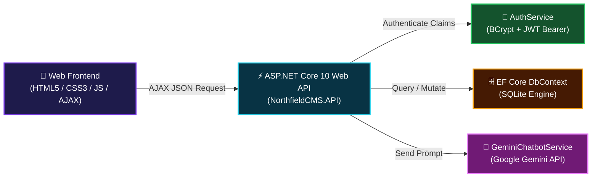
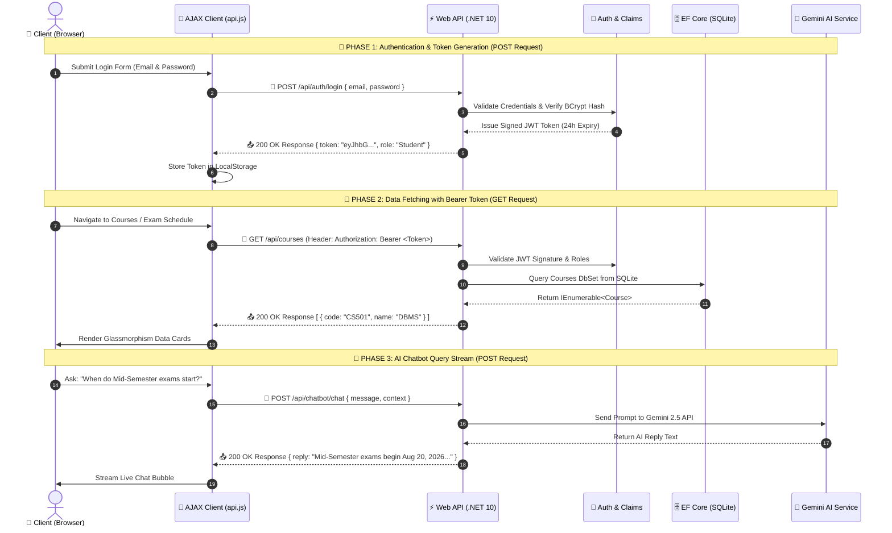

<div align="center">

  <!-- GLOWING TOP BANNER CARD -->
  <a href="https://github.com/kirtan1911/CP-CMS">
    
  </a>

  <br><br>

  <!-- TECH STACK BADGES MATRIX -->
  <p align="center">
    <a href="https://dotnet.microsoft.com/"></a>
    <a href="https://dotnet.microsoft.com/"></a>
    <a href="https://learn.microsoft.com/ef/core/"></a>
    <a href="https://ai.google.dev/"></a>
    <a href="https://swagger.io/"></a>
    <a href="https://github.com/kirtan1911/CP-CMS"></a>
  </p>

  <!-- QUICK NAVIGATION PILLS -->
  <p align="center">
    <a href="#-overview"><b>✨ Overview</b></a> •
    <a href="#-key-features"><b>🚀 Features</b></a> •
    <a href="#-demo-credentials"><b>🔑 Demo Credentials</b></a> •
    <a href="#-architecture--end-to-end-request-lifecycle"><b>🏛 Architecture</b></a> •
    <a href="#-swagger-api-matrix"><b>📖 Swagger API</b></a> •
    <a href="#-gemini-ai-assistant"><b>🤖 AI Assistant</b></a> •
    <a href="#-quick-start-guide"><b>⚡ Quick Start</b></a>
  </p>

</div>

---

<a id="-overview"></a>
## ✨ Overview

> **Northfield College Management System (CP-CMS)** is a premium, full-stack Academic ERP platform designed for modern universities and colleges. Built with a high-performance **ASP.NET Core (.NET 10) RESTful Web API** backend, **Entity Framework Core with SQLite**, **JWT Bearer Authentication**, and an **Apple-inspired Liquid Glassmorphism UI**, CP-CMS includes a **Google Gemini-powered AI Chatbot** for instant academic Q&A.

<br>

<a id="-key-features"></a>
## 🚀 Key Features

<table width="100%">
  <tr>
    <td width="50%" valign="top">
      <div align="left">
        <h3>🔐 Authentication & Role Security</h3>
        <ul>
          <li><b>BCrypt Hashing:</b> Passwords hashed using salted BCrypt encryption.</li>
          <li><b>JWT Bearer Tokens:</b> Signed JWT tokens with role claims & 24h expiration.</li>
          <li><b>3-Role Access Control:</b> Tailored views for <b>Admin</b>, <b>Faculty</b>, and <b>Students</b>.</li>
        </ul>
      </div>
    </td>
    <td width="50%" valign="top">
      <div align="left">
        <h3>🤖 Google Gemini AI Assistant</h3>
        <ul>
          <li><b>Gemini 2.5 Flash API Integration:</b> Natural language response generation.</li>
          <li><b>Dedicated AI Page:</b> Fullscreen <code>chatbot.html</code> & floating widget.</li>
          <li><b>Context-Aware Engine:</b> Intelligent fallback responses for offline/demo modes.</li>
        </ul>
      </div>
    </td>
  </tr>
  <tr>
    <td width="50%" valign="top">
      <div align="left">
        <h3>📊 Academic & Operational ERP</h3>
        <ul>
          <li><b>Student & Faculty Management:</b> Real-time user directory & status tracking.</li>
          <li><b>Attendance & Exam Management:</b> Threshold checks, timetables, and results.</li>
          <li><b>Tuition Fee System:</b> Paid vs Pending fee breakdown per course.</li>
        </ul>
      </div>
    </td>
    <td width="50%" valign="top">
      <div align="left">
        <h3>🎨 Liquid Glassmorphism UI</h3>
        <ul>
          <li><b>Modern Glass Skins:</b> Translucent blurred panels, ambient glowing drifting light.</li>
          <li><b>Dynamic AJAX Client:</b> Centralized <code>api.js</code> connecting UI directly to Web API.</li>
          <li><b>Fully Responsive:</b> Mobile drawer sidebar & desktop dashboard.</li>
        </ul>
      </div>
    </td>
  </tr>
</table>

<br>

<a id="-demo-credentials"></a>
## 🔑 Pre-Seeded Demo Accounts

Test the system instantly using any of the pre-configured accounts below:

| Role | Full Name | Email Address | Password | Privileges & Capabilities |
| :--- | :--- | :--- | :--- | :--- |
|  | **Prof. Rajesh Kumar** | `admin@northfield.edu` | `admin123` | Full system control, user creation, course & department setup |
|  | **Dr. Meera Shah** | `meera.shah@northfield.edu` | `faculty123` | Exam scheduling, attendance marking, student result entry |
|  | **Riya Mehta** | `riya.mehta@northfield.edu` | `student123` | View enrolled courses, check attendance %, fee dues & exam dates |

<br>

<a id="-architecture--end-to-end-request-lifecycle"></a>
## 🏛 Architecture & End-to-End Request Lifecycle

### 1️⃣ High-Level System Architecture



<br>

### 2️⃣ Step-by-Step Request & Response Sequence Flow



<br>

<a id="-swagger-api-matrix"></a>
## 📖 Swagger API Matrix

Explore and test all RESTful Web API endpoints interactively at `http://localhost:5116/swagger`:

| Method | Endpoint | Authorization | Description |
| :---: | :--- | :---: | :--- |
|  | `/api/auth/login` | Public | Authenticates user & issues signed JWT Token |
|  | `/api/auth/register` | Public | Registers new system user account |
|  | `/api/auth/me` |  | Returns current authenticated user claims |
|  | `/api/users` | Public | Retrieves system users list |
|  | `/api/users` |  | Creates new system user |
|  | `/api/students` | Public | Retrieves enrolled students list |
|  | `/api/faculty` | Public | Retrieves faculty members list |
|  | `/api/courses` | Public | Retrieves academic courses catalog |
|  | `/api/departments` | Public | Retrieves college departments |
|  | `/api/exams` | Public | Retrieves examination timetables |
|  | `/api/fees` | Public | Retrieves student fee payment status |
|  | `/api/materials` | Public | Retrieves uploaded course study materials |
|  | `/api/chatbot/chat` | Public | Submits prompt to Gemini AI Chatbot |

<br>

<a id="-gemini-ai-assistant"></a>
## 🤖 Dedicated Gemini AI Assistant Page

Access the dedicated AI Chatbot interface at `frontend/chatbot.html`:

- **Quick Action Prompt Chips:** Instant answers for Exam Timetables, Attendance Percentage, Fee Payments, and Faculty Info.
- **Typing Indicators:** Visual animated loading state during response generation.
- **Smart Fallback Engine:** Offline context processing ensuring uninterrupted uptime even without active network keys.

<br>

<a id="-quick-start-guide"></a>
## ⚡ Quick Start Guide

### 1️⃣ Clone the Repository
```bash
git clone https://github.com/kirtan1911/CP-CMS.git
cd CP-CMS
```

### 2️⃣ Run ASP.NET Core Web API
```bash
cd backend/NorthfieldCMS.API
dotnet run --urls "http://localhost:5116"
```

### 3️⃣ Launch Web App & Swagger
- **Swagger Documentation:** Open `http://localhost:5116/swagger`
- **Web Frontend:** Open `frontend/login.html` or `frontend/dashboard.html`
- **Dedicated AI Chatbot:** Open `frontend/chatbot.html`

<br>

<a id="-project-structure"></a>
## 📁 Project Folder Structure

```
CP-CMS/
├── backend/
│   └── NorthfieldCMS.API/
│       ├── Controllers/          # Auth, Chatbot & Data Controllers
│       ├── Data/                 # EF Core DbContext & Seed Data
│       ├── DTOs/                 # Request & Response Data Transfer Objects
│       ├── Models/               # Domain Models & Entities
│       ├── Services/             # AuthService & GeminiChatbotService
│       ├── Properties/           # launchSettings.json
│       ├── Program.cs            # Builder Services, Middleware & Swagger Setup
│       └── appsettings.json      # JWT Secret & Connection Config
│
├── frontend/
│   ├── login.html                # Auth Screen (Login & Register)
│   ├── dashboard.html            # Main Overview Dashboard
│   ├── chatbot.html              # Dedicated Gemini AI Assistant Page
│   ├── students.html             # Student Management
│   ├── faculty.html              # Faculty Management
│   ├── courses.html              # Course Management
│   ├── attendance.html           # Attendance Tracking
│   ├── exams.html                # Exam Timetable & Schedule
│   ├── marks-results.html        # Academic Marks & Results
│   ├── fees.html                 # Tuition Fee Records
│   ├── materials.html            # Study Materials Repository
│   ├── notifications.html        # System Notices & Alerts
│   └── js/
│       ├── api.js                # Centralized AJAX Client
│       └── chatbot.js            # Floating Chatbot Widget UI
│
├── .gitignore                    # Git Ignore Rules
└── README.md                     # Documentation
```

---

<div align="center">
  <br>
  <p>Crafted with ❤️ by <b>Kirtan Barot</b></p>
  <p><a href="https://github.com/kirtan1911/CP-CMS">⭐ <b>Star CP-CMS on GitHub</b></a> if you love this project!</p>
  <br>
</div>
