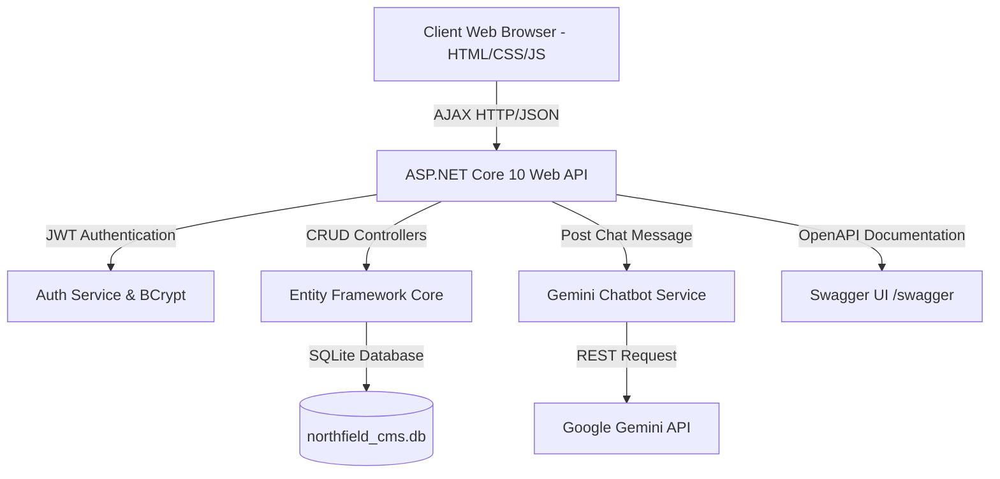

<div align="center">

  <h1>🎓 Northfield College Management System (CP-CMS)</h1>
  <p><b>Next-Gen AI-Powered Enterprise Academic & College Management ERP</b></p>

  <p>
    <a href="https://github.com/kirtan1911/CP-CMS"></a>
    <a href="https://github.com/kirtan1911/CP-CMS"></a>
    <a href="https://github.com/kirtan1911/CP-CMS"></a>
    <a href="https://github.com/kirtan1911/CP-CMS"></a>
    <a href="https://github.com/kirtan1911/CP-CMS"></a>
    <a href="https://github.com/kirtan1911/CP-CMS"></a>
  </p>

  <br>

  <p align="center">
    <a href="#-key-features"><b>Key Features</b></a> •
    <a href="#-demo-credentials"><b>Demo Accounts</b></a> •
    <a href="#-quick-start"><b>Quick Start</b></a> •
    <a href="#-architecture"><b>Architecture</b></a> •
    <a href="#-swagger-api"><b>Swagger API</b></a> •
    <a href="#-ai-chatbot"><b>AI Chatbot</b></a>
  </p>
</div>

---

## 🌟 Overview

**Northfield College Management System (CP-CMS)** is a state-of-the-art, full-stack Academic ERP platform designed for modern educational institutions. Featuring an **ASP.NET Core (.NET 10) RESTful Web API** backend, **Entity Framework Core with SQLite**, **JWT Bearer Authentication**, and a **Liquid Glassmorphism Web Frontend**, CP-CMS integrates an **AI Chatbot powered by Google Gemini** for instantaneous academic query resolutions.

---

## 🚀 Key Features

<table>
  <tr>
    <td width="50%">
      <h3>🔐 Authentication & Security</h3>
      <ul>
        <li><b>BCrypt Hashing</b> with auto-salt verification for passwords.</li>
        <li><b>JWT Bearer Authentication</b> signed claims & expiration handling.</li>
        <li><b>3-Tier Role Access Control</b> (Admin, Faculty, Student).</li>
      </ul>
    </td>
    <td width="50%">
      <h3>🤖 Gemini AI Assistant</h3>
      <ul>
        <li>Integrated <b>Google Gemini 2.5</b> model for instant Q&A.</li>
        <li>Dedicated <code>chatbot.html</code> page & floating widget.</li>
        <li>Context-aware responses for exams, fees, and attendance.</li>
      </ul>
    </td>
  </tr>
  <tr>
    <td width="50%">
      <h3>📊 Operations & Analytics</h3>
      <ul>
        <li>Course registration, timetable & department tracking.</li>
        <li>Student attendance tracking with percentage thresholds.</li>
        <li>Mid-term & Final exam scheduling with result processing.</li>
      </ul>
    </td>
    <td width="50%">
      <h3>🎨 Premium Liquid Glass UI</h3>
      <ul>
        <li>Apple-inspired <b>Liquid Glassmorphism</b> aesthetic.</li>
        <li>Responsive sidebar, dark mode design tokens, dynamic charts.</li>
        <li>AJAX integration connecting frontend directly to backend APIs.</li>
      </ul>
    </td>
  </tr>
</table>

---

## 🔑 Pre-seeded Demo Accounts

Use any of the pre-configured credentials below to test different role permissions:

| Role | Full Name | Email Address | Password | Privileges |
| :--- | :--- | :--- | :--- | :--- |
| <span id="admin-badge"><b>ADMIN</b></span> | Prof. Rajesh Kumar | `admin@northfield.edu` | `admin123` | Full system governance, user management, course & department creation |
| <span id="faculty-badge"><b>FACULTY</b></span> | Dr. Meera Shah | `meera.shah@northfield.edu` | `faculty123` | Course teaching, exam scheduling, attendance recording & marks entry |
| <span id="student-badge"><b>STUDENT</b></span> | Riya Mehta | `riya.mehta@northfield.edu` | `student123` | View enrolled courses, check attendance %, fee dues & exam results |

---

## 🏛 Architecture



---

## ⚡ Quick Start Guide

### Prerequisites
- [.NET 10.0 SDK](https://dotnet.microsoft.com/download)
- Web Browser (Chrome, Edge, Firefox, or Safari)

### 1️⃣ Clone the Repository
```bash
git clone https://github.com/kirtan1911/CP-CMS.git
cd CP-CMS
```

### 2️⃣ Run ASP.NET Core Backend Web API
```bash
cd backend/NorthfieldCMS.API
dotnet run --urls "http://localhost:5116"
```
> The API server will start listening on `http://localhost:5116`. Database tables and initial seed data will automatically initialize!

### 3️⃣ Launch Web Frontend & Swagger UI
- **Swagger Documentation**: Open `http://localhost:5116/swagger` in your browser.
- **Web App Interface**: Open `frontend/login.html` or `frontend/dashboard.html` in your web browser.
- **Dedicated AI Chatbot**: Open `frontend/chatbot.html` in your web browser.

---

## 📖 Swagger API Endpoints Guide

Access interactive OpenAPI documentation directly at `http://localhost:5116/swagger`:

```
POST   /api/auth/login            # User login & JWT issuance
POST   /api/auth/register         # User registration
GET    /api/auth/me               # Current authenticated user details

GET    /api/users                 # Fetch system users list (Admin)
GET    /api/students              # Fetch enrolled students list
GET    /api/faculty               # Fetch faculty members list
GET    /api/courses               # Fetch academic courses list
GET    /api/departments           # Fetch college departments
GET    /api/exams                 # Fetch exam schedules
GET    /api/fees                  # Fetch fee payment records
GET    /api/notifications         # Fetch system notifications
GET    /api/materials             # Fetch course study materials

POST   /api/chatbot/chat          # Send query to Gemini AI Chatbot
```

---

## 🤖 Dedicated Gemini AI Assistant Page

CP-CMS includes a dedicated AI Assistant page (`frontend/chatbot.html`) with:
- **Interactive Preset Chips**: One-click prompts for Exam Schedules, Attendance Check, Fee Dues, and Faculty Directory.
- **Real-Time Stream**: Live response generation with typing indicators.
- **Smart Fallback Engine**: Uninterrupted offline context handling when network or API rate limits occur.

---

## 📁 Project Structure

```
CP-CMS/
├── backend/
│   └── NorthfieldCMS.API/
│       ├── Controllers/          # Auth, Chatbot, Data Controllers
│       ├── Data/                 # ApplicationDbContext & Seed Data
│       ├── DTOs/                 # Request & Response Data Transfer Objects
│       ├── Models/               # Domain Models & Entities
│       ├── Services/             # AuthService (JWT/BCrypt), GeminiChatbotService
│       ├── Properties/           # launchSettings.json
│       ├── Program.cs            # App Builder, Middleware, Swagger Setup
│       └── appsettings.json      # JWT & App Configuration
│
├── frontend/
│   ├── login.html                # Auth Screen (Login & Register)
│   ├── dashboard.html            # Main Overview Dashboard
│   ├── chatbot.html              # Dedicated Gemini AI Assistant Page
│   ├── students.html             # Students Management
│   ├── faculty.html              # Faculty Management
│   ├── courses.html              # Course Management
│   ├── attendance.html           # Attendance Tracking
│   ├── exams.html                # Exam Timetables & Schedule
│   ├── marks-results.html        # Academic Marks & Results
│   ├── fees.html                 # Tuition Fee Records
│   ├── materials.html            # Study Materials Repository
│   ├── notifications.html        # System Notices & Alerts
│   └── js/
│       ├── api.js                # Centralized AJAX Client
│       └── chatbot.js            # Floating Chatbot Widget UI
│
├── .gitignore                    # Excluded files list
└── README.md                     # Project documentation
```

---

<div align="center">
  <p>Maintained with ❤️ by <b>Kirtan Barot</b></p>
  <p><a href="https://github.com/kirtan1911/CP-CMS">⭐ Star this repository if you find it helpful!</a></p>
</div>
